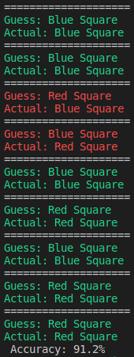

# Neural Network from the ground up
I had a hard time deciding exactly **what** I wanted to do for my final.

I toyed back and forth with creating some sort of game--like checkers or snake, and having the A.I. be pitted again the user or utilizing a neural network for some sort of detection and classification scheme. I actually started on a game of checkers and got bored half-way through... But, after seeing what some of the other students have done, I think I want to go the route of building my own simple neural network to determine colors and shapes.

Part of the reason for me wanting to go this route, is there are **a lot** of online tutorials and the like for neural networks, but they all seem to just spit out the same couple of lines of code and recite it as magic and claim you've built a neural network. I want to get a much better, fundamental understanding instead of just following along with some tutorial and modifying lines here or there to make it my own. 

Now, don't get me wrong, those tutorials and guides are incredibly useful and show a plethora of tools that are at all of our finger-tips. The modern tools like Keras or tensorflow or pytorch or caffe, (the list goes on...) are great for starting out and toying around w/ a neural network, but I want to get my hands dirty with planning out the creation of a neural network. 

I decided to start with a simple perceptron that could regonize the difference between squares that were red or blue to start. Right now, all the perceptron will care about is recognizing red or blue. (Since both are squares) 

After the perceptron was created and the shapes were passed in, I decided to test how well it did after attempting to categorize 1,000,000 shapes into either red or blue squares. 

This is the result:

 This perceptron won't be taking over humanity _just_ yet.

A pretty nice accuracy of 91.2%, not bad. However, this isn't a very complicated "dataset", let's change that. 

The perceptron is akin to a neuron, and since our perceptron only cares about blue or red squares, we should create another perceptron that cares about shapes, like a square vs a circle. Then we can hook these two perceptrons together.